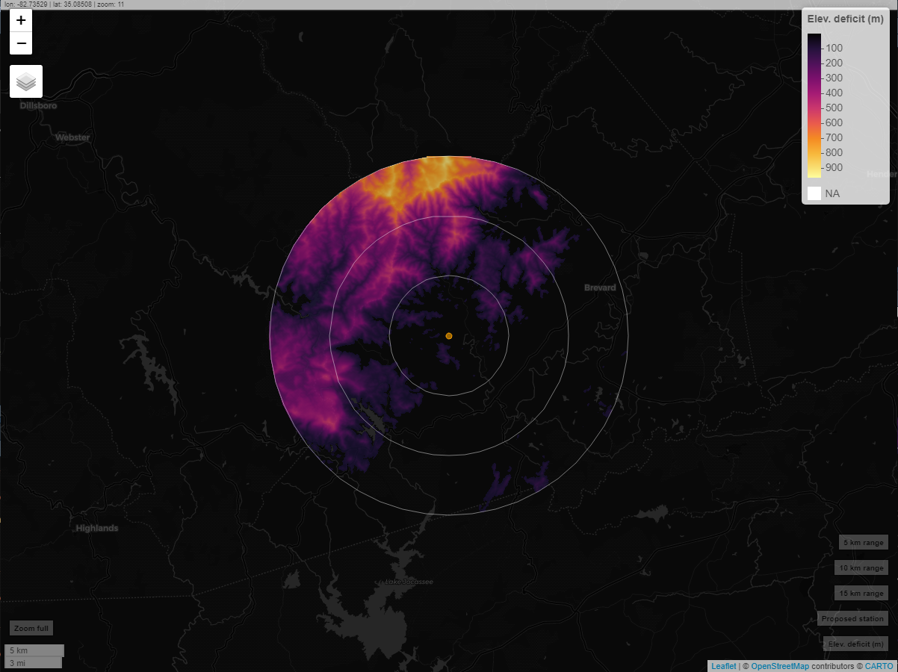

<!-- badges: start -->
[](https://mybinder.org/v2/gh/adamdsmith/motus_viewshed/master?urlpath=rstudio)
<!-- badges: end -->

This is a test…

First, source the viewshed generating function…

``` r
source("R/motus_viewshed.R")
```

Second, find the coordinates of the location of the proposed station.
These are a length two vector of \[latitude, longitude\]. Here we pick
the coordinates of the Motus station at the Pisgah Astronomical Research
Institute.

Third, figure out the height of the antennas, in meters, at the
existing/proposed station. You can also leave this at the default (0) to
get a sense of how high antennas may need to be installed. Here, we use
the height of the installed antennas (6 meters).

Pass these parameters to the `motus_viewshed` function, and voila, a
fully interactive viewshed for your inspection (below image is not
interactive on Github):

``` r
motus_viewshed(coords = c(35.196986, -82.873250), ht = 6)
```


